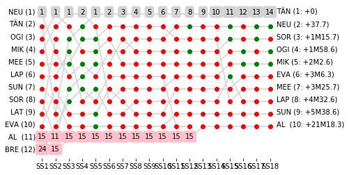

# Rally Report - Argentina

*This report is unofficial and is not associated in any way with the Fédération Internationale de l’Automobile (FIA) or WRC Promoter GmbH.*

YPF Rally Argentina (2018-04-26 to 2018-04-29) runs over 18 competitive special stages. The distance covered on the special stages is 358.25km, with an overall rally distance of 1301.25km. The special stage surface type is predominantly .

