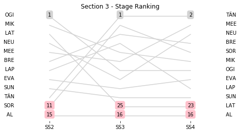

# Section 3, Friday April 27th

This section comprises three special stages (SS2 - LAS BAJADAS - VILLA DEL DIQUE (I) (16.65km), SS3 - AMBOY - YACANTO (I) (33.58km), SS4 - SANTA ROSA - SAN AGUSTIN (I) (23.85km))

The full scheduled itinerary for the section was as follows:

	- 06:25:00 TC1B Parc Ferme OUT / Service IN  [00:00:00]
	- 06:40:00 TC1C Service OUT  [00:15:00]
	- 08:10:00 TC2 LAS BAJADAS - VILLA DEL DIQUE (I) (97.54km) [01:30:00]
	- 08:13:00 SS2 LAS BAJADAS - VILLA DEL DIQUE (I) (16.65km) [00:03:00]
	- 08:57:00 TC3 AMBOY - YACANTO (I) (19.53km) [00:44:00]
	- 09:00:00 SS3 AMBOY - YACANTO (I) (33.58km) [00:03:00]
	- 10:10:00 TC4 SANTA ROSA - SAN AGUSTIN (I) (39.74km) [01:10:00]
	- 10:13:00 SS4 SANTA ROSA - SAN AGUSTIN (I) (23.85km) [00:03:00]
	- 11:53:00 TC4A Regrouping IN (92.89km) [01:40:00]

### Section 3 Report
Section 3

Section 3

Stage Result - SS2

|Driver|            Team             |Elapsed Duration|Position|Class Rank|   diffFirst    |    diffPrev    |
|------|-----------------------------|----------------|-------:|---------:|----------------|----------------|
|OGI   |M-SPORT FORD WORLD RALLY TEAM|00:08:55.7000000|       1|         1|00:00:00        |00:00:00        |
|MIK   |HYUNDAI SHELL MOBIS WRT      |00:08:59.6000000|       2|         2|00:00:03.9000000|00:00:03.9000000|
|LAT   |TOYOTA GAZOO RACING WRT      |00:09:01.3000000|       3|         3|00:00:05.6000000|00:00:01.7000000|
|NEU   |HYUNDAI SHELL MOBIS WRT      |00:09:03.7000000|       4|         4|00:00:08        |00:00:02.4000000|
|MEE   |CITROEN TOTAL ABU DHABI WRT  |00:09:06.5000000|       5|         5|00:00:10.8000000|00:00:02.8000000|
|BRE   |CITROEN TOTAL ABU DHABI WRT  |00:09:07.7000000|       6|         6|00:00:12        |00:00:01.2000000|
|LAP   |TOYOTA GAZOO RACING WRT      |00:09:09.9000000|       7|         7|00:00:14.2000000|00:00:02.2000000|
|EVA   |M-SPORT FORD WORLD RALLY TEAM|00:09:12.9000000|       8|         8|00:00:17.2000000|00:00:03        |
|SUN   |M-SPORT FORD WORLD RALLY TEAM|00:09:16.2000000|       9|         9|00:00:20.5000000|00:00:03.3000000|
|TÄN   |TOYOTA GAZOO RACING WRT      |00:09:19.5000000|      10|        10|00:00:23.8000000|00:00:03.3000000|
|SOR   |HYUNDAI SHELL MOBIS WRT      |00:09:19.9000000|      11|        11|00:00:24.2000000|00:00:00.4000000|
|AL    |CITROEN TOTAL ABU DHABI WRT  |00:09:59.7000000|      15|        12|00:01:04        |00:00:01.6000000|

Stage Result - SS3

|Driver|            Team             |Elapsed Duration|Position|Class Rank|   diffFirst    |    diffPrev    |
|------|-----------------------------|----------------|-------:|---------:|----------------|----------------|
|TÄN   |TOYOTA GAZOO RACING WRT      |00:19:19.9000000|       1|         1|00:00:00        |00:00:00        |
|SOR   |HYUNDAI SHELL MOBIS WRT      |00:19:22.7000000|       2|         2|00:00:02.8000000|00:00:02.8000000|
|BRE   |CITROEN TOTAL ABU DHABI WRT  |00:19:27.5000000|       3|         3|00:00:07.6000000|00:00:04.8000000|
|LAP   |TOYOTA GAZOO RACING WRT      |00:19:29.1000000|       4|         4|00:00:09.2000000|00:00:01.6000000|
|MIK   |HYUNDAI SHELL MOBIS WRT      |00:19:30.1000000|       5|         5|00:00:10.2000000|00:00:01        |
|MEE   |CITROEN TOTAL ABU DHABI WRT  |00:19:33.7000000|       6|         6|00:00:13.8000000|00:00:03.6000000|
|OGI   |M-SPORT FORD WORLD RALLY TEAM|00:19:37.7000000|       7|         7|00:00:17.8000000|00:00:04        |
|NEU   |HYUNDAI SHELL MOBIS WRT      |00:19:38.3000000|       8|         8|00:00:18.4000000|00:00:00.6000000|
|EVA   |M-SPORT FORD WORLD RALLY TEAM|00:19:39.8000000|       9|         9|00:00:19.9000000|00:00:01.5000000|
|SUN   |M-SPORT FORD WORLD RALLY TEAM|00:19:45.3000000|      10|        10|00:00:25.4000000|00:00:05.5000000|
|AL    |CITROEN TOTAL ABU DHABI WRT  |00:21:23.1000000|      16|        11|00:02:03.2000000|00:00:10.9000000|
|LAT   |TOYOTA GAZOO RACING WRT      |00:26:19.9000000|      25|        12|00:07:00        |00:03:17.4000000|

Stage Result - SS4

|Driver|            Team             |Elapsed Duration|Position|Class Rank|   diffFirst    |    diffPrev    |
|------|-----------------------------|----------------|-------:|---------:|----------------|----------------|
|TÄN   |TOYOTA GAZOO RACING WRT      |00:13:42.6000000|       1|         1|00:00:00        |00:00:00        |
|MEE   |CITROEN TOTAL ABU DHABI WRT  |00:13:45.5000000|       2|         2|00:00:02.9000000|00:00:02.9000000|
|NEU   |HYUNDAI SHELL MOBIS WRT      |00:13:47.5000000|       3|         3|00:00:04.9000000|00:00:02        |
|BRE   |CITROEN TOTAL ABU DHABI WRT  |00:13:48.5000000|       4|         4|00:00:05.9000000|00:00:01        |
|SOR   |HYUNDAI SHELL MOBIS WRT      |00:13:48.6000000|       5|         5|00:00:06        |00:00:00.1000000|
|MIK   |HYUNDAI SHELL MOBIS WRT      |00:13:51.1000000|       6|         6|00:00:08.5000000|00:00:02.5000000|
|OGI   |M-SPORT FORD WORLD RALLY TEAM|00:13:52.8000000|       7|         7|00:00:10.2000000|00:00:01.7000000|
|EVA   |M-SPORT FORD WORLD RALLY TEAM|00:13:53.8000000|       8|         8|00:00:11.2000000|00:00:01        |
|LAP   |TOYOTA GAZOO RACING WRT      |00:13:56.8000000|       9|         9|00:00:14.2000000|00:00:03        |
|SUN   |M-SPORT FORD WORLD RALLY TEAM|00:13:57.2000000|      10|        10|00:00:14.6000000|00:00:00.4000000|
|AL    |CITROEN TOTAL ABU DHABI WRT  |00:15:01.2000000|      16|        11|00:01:18.6000000|00:00:00.8000000|
|LAT   |TOYOTA GAZOO RACING WRT      |00:20:42.6000000|      23|        12|00:07:00        |00:05:01.8000000|

