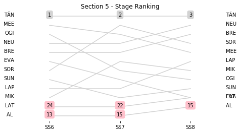

# Section 5, Friday April 27th

This section comprises three special stages (SS6 - LAS BAJADAS - VILLA DEL DIQUE (II) (16.65km), SS7 - AMBOY - YACANTO (II) (33.58km), SS8 - SANTA ROSA - SAN AGUSTIN (II) (23.85km))

The full scheduled itinerary for the section was as follows:

	- 00:00:00 TC8C Service OUT / Parc Ferme IN / For all classified cars (except re-starting crews)  [00:00:00]
	- 12:48:00 TC5B Regrouping OUT / Service IN  [00:15:00]
	- 13:18:00 TC5C Service OUT  [00:30:00]
	- 14:48:00 TC6 LAS BAJADAS - VILLA DEL DIQUE (II) (97.54km) [01:30:00]
	- 14:51:00 SS6 LAS BAJADAS - VILLA DEL DIQUE (II) (16.65km) [00:03:00]
	- 15:35:00 TC7 AMBOY - YACANTO (II) (19.53km) [00:44:00]
	- 15:38:00 SS7 AMBOY - YACANTO (II) (33.58km) [00:03:00]
	- 16:48:00 TC8 SANTA ROSA - SAN AGUSTIN (II) (39.74km) [01:10:00]
	- 16:51:00 SS8 SANTA ROSA - SAN AGUSTIN (II) (23.85km) [00:03:00]
	- 18:31:00 TC8A Technical Zone IN (91.68km) [01:40:00]
	- 18:41:00 TC8B Technical Zone OUT / Service IN  [00:10:00]

### Section 5 Report
Section 5

Section 5

Stage Result - SS6

|Driver|            Team             |Elapsed Duration|Position|Class Rank|   diffFirst    |    diffPrev    |
|------|-----------------------------|----------------|-------:|---------:|----------------|----------------|
|TÄN   |TOYOTA GAZOO RACING WRT      |00:08:43.4000000|       1|         1|00:00:00        |00:00:00        |
|MEE   |CITROEN TOTAL ABU DHABI WRT  |00:08:52        |       2|         2|00:00:08.6000000|00:00:08.6000000|
|OGI   |M-SPORT FORD WORLD RALLY TEAM|00:08:52.6000000|       3|         3|00:00:09.2000000|00:00:00.6000000|
|NEU   |HYUNDAI SHELL MOBIS WRT      |00:08:53        |       4|         4|00:00:09.6000000|00:00:00.4000000|
|BRE   |CITROEN TOTAL ABU DHABI WRT  |00:08:54.7000000|       5|         5|00:00:11.3000000|00:00:01.7000000|
|EVA   |M-SPORT FORD WORLD RALLY TEAM|00:08:57        |       6|         6|00:00:13.6000000|00:00:02.3000000|
|SOR   |HYUNDAI SHELL MOBIS WRT      |00:08:57.6000000|       7|         7|00:00:14.2000000|00:00:00.6000000|
|SUN   |M-SPORT FORD WORLD RALLY TEAM|00:09:02.1000000|       8|         8|00:00:18.7000000|00:00:04.5000000|
|LAP   |TOYOTA GAZOO RACING WRT      |00:09:10.4000000|       9|         9|00:00:27        |00:00:08.3000000|
|MIK   |HYUNDAI SHELL MOBIS WRT      |00:09:23.1000000|      10|        10|00:00:39.7000000|00:00:12.7000000|
|AL    |CITROEN TOTAL ABU DHABI WRT  |00:09:30.7000000|      13|        11|00:00:47.3000000|00:00:00.7000000|
|LAT   |TOYOTA GAZOO RACING WRT      |00:15:43.4000000|      24|        12|00:07:00        |00:01:57.4000000|

Stage Result - SS7

|Driver|            Team             |Elapsed Duration|Position|Class Rank|   diffFirst    |    diffPrev    |
|------|-----------------------------|----------------|-------:|---------:|----------------|----------------|
|TÄN   |TOYOTA GAZOO RACING WRT      |00:19:18.7000000|       1|         1|00:00:00        |00:00:00        |
|SOR   |HYUNDAI SHELL MOBIS WRT      |00:19:22.8000000|       2|         2|00:00:04.1000000|00:00:04.1000000|
|MEE   |CITROEN TOTAL ABU DHABI WRT  |00:19:23.8000000|       3|         3|00:00:05.1000000|00:00:01        |
|NEU   |HYUNDAI SHELL MOBIS WRT      |00:19:26.9000000|       4|         4|00:00:08.2000000|00:00:03.1000000|
|BRE   |CITROEN TOTAL ABU DHABI WRT  |00:19:29        |       5|         5|00:00:10.3000000|00:00:02.1000000|
|MIK   |HYUNDAI SHELL MOBIS WRT      |00:19:30.5000000|       6|         6|00:00:11.8000000|00:00:01.5000000|
|OGI   |M-SPORT FORD WORLD RALLY TEAM|00:19:32.7000000|       7|         7|00:00:14        |00:00:02.2000000|
|EVA   |M-SPORT FORD WORLD RALLY TEAM|00:19:35.3000000|       8|         8|00:00:16.6000000|00:00:02.6000000|
|LAP   |TOYOTA GAZOO RACING WRT      |00:19:38.1000000|       9|         9|00:00:19.4000000|00:00:02.8000000|
|SUN   |M-SPORT FORD WORLD RALLY TEAM|00:19:41.7000000|      10|        10|00:00:23        |00:00:03.6000000|
|AL    |CITROEN TOTAL ABU DHABI WRT  |00:20:57        |      15|        11|00:01:38.3000000|00:00:01.8000000|
|LAT   |TOYOTA GAZOO RACING WRT      |00:26:18.7000000|      22|        12|00:07:00        |00:03:36.6000000|

Stage Result - SS8

|Driver|            Team             |Elapsed Duration|Position|Class Rank|   diffFirst    |    diffPrev    |
|------|-----------------------------|----------------|-------:|---------:|----------------|----------------|
|TÄN   |TOYOTA GAZOO RACING WRT      |00:13:35        |       1|         1|00:00:00        |00:00:00        |
|NEU   |HYUNDAI SHELL MOBIS WRT      |00:13:36.4000000|       2|         2|00:00:01.4000000|00:00:01.4000000|
|BRE   |CITROEN TOTAL ABU DHABI WRT  |00:13:37.8000000|       3|         3|00:00:02.8000000|00:00:01.4000000|
|SOR   |HYUNDAI SHELL MOBIS WRT      |00:13:38.6000000|       4|         4|00:00:03.6000000|00:00:00.8000000|
|MEE   |CITROEN TOTAL ABU DHABI WRT  |00:13:40.9000000|       5|         5|00:00:05.9000000|00:00:02.3000000|
|LAP   |TOYOTA GAZOO RACING WRT      |00:13:41.1000000|       6|         6|00:00:06.1000000|00:00:00.2000000|
|MIK   |HYUNDAI SHELL MOBIS WRT      |00:13:41.2000000|       7|         7|00:00:06.2000000|00:00:00.1000000|
|OGI   |M-SPORT FORD WORLD RALLY TEAM|00:13:43.7000000|       8|         8|00:00:08.7000000|00:00:02.5000000|
|SUN   |M-SPORT FORD WORLD RALLY TEAM|00:13:48.9000000|       9|         9|00:00:13.9000000|00:00:05.2000000|
|EVA   |M-SPORT FORD WORLD RALLY TEAM|00:13:50.4000000|      10|        10|00:00:15.4000000|00:00:01.5000000|
|AL    |CITROEN TOTAL ABU DHABI WRT  |00:14:49.2000000|      15|        11|00:01:14.2000000|00:00:14.9000000|
|LAT   |TOYOTA GAZOO RACING WRT      |                |     NaN|       NaN|                |                |

