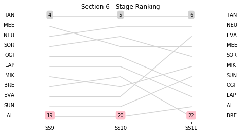

# Section 6, Saturday April 28th

This section comprises three special stages (SS9 - TANTI - MATADEROS (I)  (13.92km), SS10 - LOS GIGANTES - CUCHILLA NEVADA (I) - Live TV (16.02km), SS11 - CUCHILLA NEVADA - RIO PINTOS (I) (40.48km))

The full scheduled itinerary for the section was as follows:

	- 07:30:00 TC8D Parc Ferme OUT / Service IN  [00:00:00]
	- 07:45:00 TC8E Service OUT  [00:15:00]
	- 08:20:00 TC9 TANTI - MATADEROS (I)  (19.68km) [00:35:00]
	- 08:23:00 SS9 TANTI - MATADEROS (I)  (13.92km) [00:03:00]
	- 09:00:00 TC10 LOS GIGANTES - CUCHILLA NEVADA (I) - Live TV (12.53km) [00:37:00]
	- 09:08:00 SS10 LOS GIGANTES - CUCHILLA NEVADA (I) - Live TV (16.02km) [00:08:00]
	- 09:32:00 TC11 CUCHILLA NEVADA - RIO PINTOS (I) (0.99km) [00:24:00]
	- 09:35:00 SS11 CUCHILLA NEVADA - RIO PINTOS (I) (40.48km) [00:03:00]
	- 11:25:00 TC11A Regrouping IN (64.25km) [01:50:00]

### Section 6 Report
Section 6

Stage Result - SS9

|Driver|            Team             |Elapsed Duration|Position|Class Rank|diffFirst|diffPrev|
|------|-----------------------------|----------------|--------|----------|---------|--------|
|SOR   |HYUNDAI SHELL MOBIS WRT      |                |NaN     |NaN       |         |        |
|OGI   |M-SPORT FORD WORLD RALLY TEAM|                |NaN     |NaN       |         |        |
|NEU   |HYUNDAI SHELL MOBIS WRT      |                |NaN     |NaN       |         |        |
|TÄN   |TOYOTA GAZOO RACING WRT      |                |NaN     |NaN       |         |        |
|MEE   |CITROEN TOTAL ABU DHABI WRT  |                |NaN     |NaN       |         |        |
|EVA   |M-SPORT FORD WORLD RALLY TEAM|                |NaN     |NaN       |         |        |
|SUN   |M-SPORT FORD WORLD RALLY TEAM|                |NaN     |NaN       |         |        |
|AL    |CITROEN TOTAL ABU DHABI WRT  |                |NaN     |NaN       |         |        |
|BRE   |CITROEN TOTAL ABU DHABI WRT  |                |NaN     |NaN       |         |        |
|MIK   |HYUNDAI SHELL MOBIS WRT      |                |NaN     |NaN       |         |        |
|LAP   |TOYOTA GAZOO RACING WRT      |                |NaN     |NaN       |         |        |

Stage Result - SS10

|Driver|            Team             |Elapsed Duration|Position|Class Rank|diffFirst|diffPrev|
|------|-----------------------------|----------------|--------|----------|---------|--------|
|SOR   |HYUNDAI SHELL MOBIS WRT      |                |NaN     |NaN       |         |        |
|OGI   |M-SPORT FORD WORLD RALLY TEAM|                |NaN     |NaN       |         |        |
|BRE   |CITROEN TOTAL ABU DHABI WRT  |                |NaN     |NaN       |         |        |
|MEE   |CITROEN TOTAL ABU DHABI WRT  |                |NaN     |NaN       |         |        |
|NEU   |HYUNDAI SHELL MOBIS WRT      |                |NaN     |NaN       |         |        |
|SUN   |M-SPORT FORD WORLD RALLY TEAM|                |NaN     |NaN       |         |        |
|AL    |CITROEN TOTAL ABU DHABI WRT  |                |NaN     |NaN       |         |        |
|MIK   |HYUNDAI SHELL MOBIS WRT      |                |NaN     |NaN       |         |        |
|LAP   |TOYOTA GAZOO RACING WRT      |                |NaN     |NaN       |         |        |
|EVA   |M-SPORT FORD WORLD RALLY TEAM|                |NaN     |NaN       |         |        |
|TÄN   |TOYOTA GAZOO RACING WRT      |                |NaN     |NaN       |         |        |

Stage Result - SS11

|Driver|            Team             |Elapsed Duration|Position|Class Rank|diffFirst|diffPrev|
|------|-----------------------------|----------------|--------|----------|---------|--------|
|OGI   |M-SPORT FORD WORLD RALLY TEAM|                |NaN     |NaN       |         |        |
|BRE   |CITROEN TOTAL ABU DHABI WRT  |                |NaN     |NaN       |         |        |
|SOR   |HYUNDAI SHELL MOBIS WRT      |                |NaN     |NaN       |         |        |
|MEE   |CITROEN TOTAL ABU DHABI WRT  |                |NaN     |NaN       |         |        |
|NEU   |HYUNDAI SHELL MOBIS WRT      |                |NaN     |NaN       |         |        |
|SUN   |M-SPORT FORD WORLD RALLY TEAM|                |NaN     |NaN       |         |        |
|AL    |CITROEN TOTAL ABU DHABI WRT  |                |NaN     |NaN       |         |        |
|MIK   |HYUNDAI SHELL MOBIS WRT      |                |NaN     |NaN       |         |        |
|LAP   |TOYOTA GAZOO RACING WRT      |                |NaN     |NaN       |         |        |
|EVA   |M-SPORT FORD WORLD RALLY TEAM|                |NaN     |NaN       |         |        |
|TÄN   |TOYOTA GAZOO RACING WRT      |                |NaN     |NaN       |         |        |

