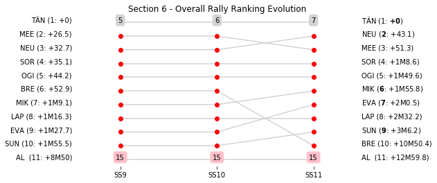

# Section 6, Saturday April 28th

This section comprises three special stages (SS9 - TANTI - MATADEROS (I)  (13.92km), SS10 - LOS GIGANTES - CUCHILLA NEVADA (I) - Live TV (16.02km), SS11 - CUCHILLA NEVADA - RIO PINTOS (I) (40.48km))

The full scheduled itinerary for the section was as follows:

	- 07:30:00 TC8D Parc Ferme OUT / Service IN  [00:00:00]
	- 07:45:00 TC8E Service OUT  [00:15:00]
	- 08:20:00 TC9 TANTI - MATADEROS (I)  (19.68km) [00:35:00]
	- 08:23:00 SS9 TANTI - MATADEROS (I)  (13.92km) [00:03:00]
	- 09:00:00 TC10 LOS GIGANTES - CUCHILLA NEVADA (I) - Live TV (12.53km) [00:37:00]
	- 09:08:00 SS10 LOS GIGANTES - CUCHILLA NEVADA (I) - Live TV (16.02km) [00:08:00]
	- 09:32:00 TC11 CUCHILLA NEVADA - RIO PINTOS (I) (0.99km) [00:24:00]
	- 09:35:00 SS11 CUCHILLA NEVADA - RIO PINTOS (I) (40.48km) [00:03:00]
	- 11:25:00 TC11A Regrouping IN (64.25km) [01:50:00]

### Section 6 Report
Section 6

Section 6

Stage Result - SS9

|Driver|            Team             |Elapsed Duration|Position|Class Rank|   diffFirst    |    diffPrev    |
|------|-----------------------------|----------------|-------:|---------:|----------------|----------------|
|TÄN   |TOYOTA GAZOO RACING WRT      |00:09:00.1000000|       1|         1|00:00:00        |00:00:00        |
|MEE   |CITROEN TOTAL ABU DHABI WRT  |00:09:03.9000000|       2|         2|00:00:03.8000000|00:00:03.8000000|
|NEU   |HYUNDAI SHELL MOBIS WRT      |00:09:04.2000000|       3|         3|00:00:04.1000000|00:00:00.3000000|
|SOR   |HYUNDAI SHELL MOBIS WRT      |00:09:05.7000000|       4|         4|00:00:05.6000000|00:00:01.5000000|
|OGI   |M-SPORT FORD WORLD RALLY TEAM|00:09:07.9000000|       5|         5|00:00:07.8000000|00:00:02.2000000|
|LAP   |TOYOTA GAZOO RACING WRT      |00:09:08.5000000|       6|         6|00:00:08.4000000|00:00:00.6000000|
|MIK   |HYUNDAI SHELL MOBIS WRT      |00:09:10.7000000|       7|         7|00:00:10.6000000|00:00:02.2000000|
|BRE   |CITROEN TOTAL ABU DHABI WRT  |00:09:11.8000000|       8|         8|00:00:11.7000000|00:00:01.1000000|
|EVA   |M-SPORT FORD WORLD RALLY TEAM|00:09:17.5000000|       9|         9|00:00:17.4000000|00:00:05.7000000|
|SUN   |M-SPORT FORD WORLD RALLY TEAM|00:09:21.9000000|      10|        10|00:00:21.8000000|00:00:04.4000000|
|AL    |CITROEN TOTAL ABU DHABI WRT  |00:09:46.3000000|      19|        11|00:00:46.2000000|00:00:01.2000000|

Stage Result - SS10

|Driver|            Team             |Elapsed Duration|Position|Class Rank|   diffFirst    |    diffPrev    |
|------|-----------------------------|----------------|-------:|---------:|----------------|----------------|
|TÄN   |TOYOTA GAZOO RACING WRT      |00:08:16.7000000|       1|         1|00:00:00        |00:00:00        |
|NEU   |HYUNDAI SHELL MOBIS WRT      |00:08:21.5000000|       2|         2|00:00:04.8000000|00:00:04.8000000|
|SOR   |HYUNDAI SHELL MOBIS WRT      |00:08:21.8000000|       3|         3|00:00:05.1000000|00:00:00.3000000|
|MEE   |CITROEN TOTAL ABU DHABI WRT  |00:08:24.2000000|       4|         4|00:00:07.5000000|00:00:02.4000000|
|OGI   |M-SPORT FORD WORLD RALLY TEAM|00:08:27.9000000|       5|         5|00:00:11.2000000|00:00:03.7000000|
|LAP   |TOYOTA GAZOO RACING WRT      |00:08:28.4000000|       6|         6|00:00:11.7000000|00:00:00.5000000|
|BRE   |CITROEN TOTAL ABU DHABI WRT  |00:08:30.2000000|       7|         7|00:00:13.5000000|00:00:01.8000000|
|MIK   |HYUNDAI SHELL MOBIS WRT      |00:08:32.2000000|       8|         8|00:00:15.5000000|00:00:02        |
|EVA   |M-SPORT FORD WORLD RALLY TEAM|00:08:33.2000000|       9|         9|00:00:16.5000000|00:00:01        |
|SUN   |M-SPORT FORD WORLD RALLY TEAM|00:08:39.4000000|      10|        10|00:00:22.7000000|00:00:06.2000000|
|AL    |CITROEN TOTAL ABU DHABI WRT  |00:09:15.5000000|      20|        11|00:00:58.8000000|00:00:03.3000000|

Stage Result - SS11

|Driver|            Team             |Elapsed Duration|Position|Class Rank|   diffFirst    |    diffPrev    |
|------|-----------------------------|----------------|-------:|---------:|----------------|----------------|
|TÄN   |TOYOTA GAZOO RACING WRT      |00:24:31        |       1|         1|00:00:00        |00:00:00        |
|NEU   |HYUNDAI SHELL MOBIS WRT      |00:24:36.6000000|       2|         2|00:00:05.6000000|00:00:05.6000000|
|EVA   |M-SPORT FORD WORLD RALLY TEAM|00:24:47.3000000|       3|         3|00:00:16.3000000|00:00:10.7000000|
|MEE   |CITROEN TOTAL ABU DHABI WRT  |00:24:48.3000000|       4|         4|00:00:17.3000000|00:00:01        |
|SOR   |HYUNDAI SHELL MOBIS WRT      |00:24:59.4000000|       5|         5|00:00:28.4000000|00:00:11.1000000|
|MIK   |HYUNDAI SHELL MOBIS WRT      |00:25:02.2000000|       6|         6|00:00:31.2000000|00:00:02.8000000|
|SUN   |M-SPORT FORD WORLD RALLY TEAM|00:25:19        |       7|         7|00:00:48        |00:00:16.8000000|
|OGI   |M-SPORT FORD WORLD RALLY TEAM|00:25:25.2000000|       8|         8|00:00:54.2000000|00:00:06.2000000|
|LAP   |TOYOTA GAZOO RACING WRT      |00:25:35.2000000|       9|         9|00:01:04.2000000|00:00:10        |
|AL    |CITROEN TOTAL ABU DHABI WRT  |00:27:42        |      16|        10|00:03:11        |00:00:05.5000000|
|BRE   |CITROEN TOTAL ABU DHABI WRT  |00:34:15        |      22|        11|00:09:44        |00:01:05.5000000|

