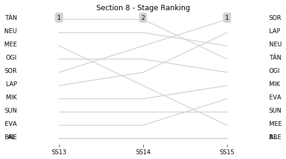

# Section 8, Saturday April 28th

This section comprises three special stages (SS13 - TANTI - MATADEROS (II)  (13.92km), SS14 - LOS GIGANTES - CUCHILLA NEVADA (II) - Live TV (16.02km), SS15 - CUCHILLA NEVADA - RIO PINTOS (II) (40.48km))

The full scheduled itinerary for the section was as follows:

	- 00:00:00 TC15C Service OUT / Parc Ferme IN / For all classified cars (except re-starting crews)  [00:45:00]
	- 12:15:00 TC12B Regrouping OUT / Service IN  [00:12:00]
	- 12:45:00 TC12C Service OUT  [00:30:00]
	- 13:20:00 TC13 TANTI - MATADEROS (II)  (19.68km) [00:35:00]
	- 13:23:00 SS13 TANTI - MATADEROS (II)  (13.92km) [00:03:00]
	- 14:00:00 TC14 LOS GIGANTES - CUCHILLA NEVADA (II) - Live TV (12.53km) [00:37:00]
	- 14:08:00 SS14 LOS GIGANTES - CUCHILLA NEVADA (II) - Live TV (16.02km) [00:08:00]
	- 14:32:00 TC15 CUCHILLA NEVADA - RIO PINTOS (II) (0.99km) [00:24:00]
	- 14:35:00 SS15 CUCHILLA NEVADA - RIO PINTOS (II) (40.48km) [00:03:00]
	- 16:25:00 TC15A Technical Zone IN (63.64km) [01:50:00]
	- 16:35:00 TC15B Technical Zone OUT / Service IN  [00:10:00]

### Section 8 Report
Section 8

Section 8

Stage Result - SS13

|Driver|            Team             |Elapsed Duration|Position|Class Rank|   diffFirst    |    diffPrev    |
|------|-----------------------------|----------------|-------:|---------:|----------------|----------------|
|TÄN   |TOYOTA GAZOO RACING WRT      |00:08:59.9000000|       1|         1|00:00:00        |00:00:00        |
|NEU   |HYUNDAI SHELL MOBIS WRT      |00:09:02.1000000|       2|         2|00:00:02.2000000|00:00:02.2000000|
|MEE   |CITROEN TOTAL ABU DHABI WRT  |00:09:02.8000000|       3|         3|00:00:02.9000000|00:00:00.7000000|
|OGI   |M-SPORT FORD WORLD RALLY TEAM|00:09:03.4000000|       4|         4|00:00:03.5000000|00:00:00.6000000|
|SOR   |HYUNDAI SHELL MOBIS WRT      |00:09:04.8000000|       5|         5|00:00:04.9000000|00:00:01.4000000|
|LAP   |TOYOTA GAZOO RACING WRT      |00:09:05.5000000|       6|         6|00:00:05.6000000|00:00:00.7000000|
|MIK   |HYUNDAI SHELL MOBIS WRT      |00:09:07.2000000|       7|         7|00:00:07.3000000|00:00:01.7000000|
|SUN   |M-SPORT FORD WORLD RALLY TEAM|00:09:13.4000000|       8|         8|00:00:13.5000000|00:00:06.2000000|
|EVA   |M-SPORT FORD WORLD RALLY TEAM|00:09:14.9000000|       9|         9|00:00:15        |00:00:01.5000000|
|AL    |CITROEN TOTAL ABU DHABI WRT  |00:09:37.1000000|      14|        10|00:00:37.2000000|00:00:04.6000000|
|BRE   |CITROEN TOTAL ABU DHABI WRT  |                |     NaN|       NaN|                |                |

Stage Result - SS14

|Driver|            Team             |Elapsed Duration|Position|Class Rank|   diffFirst    |    diffPrev    |
|------|-----------------------------|----------------|-------:|---------:|----------------|----------------|
|TÄN   |TOYOTA GAZOO RACING WRT      |00:08:15.5000000|       1|         1|00:00:00        |00:00:00        |
|NEU   |HYUNDAI SHELL MOBIS WRT      |00:08:17.6000000|       2|         2|00:00:02.1000000|00:00:02.1000000|
|SOR   |HYUNDAI SHELL MOBIS WRT      |00:08:17.6000000|       3|         3|00:00:02.1000000|00:00:00        |
|OGI   |M-SPORT FORD WORLD RALLY TEAM|00:08:18.5000000|       4|         4|00:00:03        |00:00:00.9000000|
|LAP   |TOYOTA GAZOO RACING WRT      |00:08:18.9000000|       5|         5|00:00:03.4000000|00:00:00.4000000|
|MEE   |CITROEN TOTAL ABU DHABI WRT  |00:08:19.7000000|       6|         6|00:00:04.2000000|00:00:00.8000000|
|MIK   |HYUNDAI SHELL MOBIS WRT      |00:08:20.2000000|       7|         7|00:00:04.7000000|00:00:00.5000000|
|SUN   |M-SPORT FORD WORLD RALLY TEAM|00:08:28.4000000|       8|         8|00:00:12.9000000|00:00:08.2000000|
|EVA   |M-SPORT FORD WORLD RALLY TEAM|00:08:30        |       9|         9|00:00:14.5000000|00:00:01.6000000|
|AL    |CITROEN TOTAL ABU DHABI WRT  |00:08:55.2000000|      13|        10|00:00:39.7000000|00:00:07.3000000|
|BRE   |CITROEN TOTAL ABU DHABI WRT  |                |     NaN|       NaN|                |                |

Stage Result - SS15

|Driver|            Team             |Elapsed Duration|Position|Class Rank|   diffFirst    |    diffPrev    |
|------|-----------------------------|----------------|-------:|---------:|----------------|----------------|
|SOR   |HYUNDAI SHELL MOBIS WRT      |00:24:03        |       1|         1|00:00:00        |00:00:00        |
|LAP   |TOYOTA GAZOO RACING WRT      |00:24:09.7000000|       2|         2|00:00:06.7000000|00:00:06.7000000|
|NEU   |HYUNDAI SHELL MOBIS WRT      |00:24:10.4000000|       3|         3|00:00:07.4000000|00:00:00.7000000|
|TÄN   |TOYOTA GAZOO RACING WRT      |00:24:10.4000000|       4|         4|00:00:07.4000000|00:00:00        |
|OGI   |M-SPORT FORD WORLD RALLY TEAM|00:24:12.9000000|       5|         5|00:00:09.9000000|00:00:02.5000000|
|MIK   |HYUNDAI SHELL MOBIS WRT      |00:24:14.6000000|       6|         6|00:00:11.6000000|00:00:01.7000000|
|EVA   |M-SPORT FORD WORLD RALLY TEAM|00:24:24.7000000|       7|         7|00:00:21.7000000|00:00:10.1000000|
|SUN   |M-SPORT FORD WORLD RALLY TEAM|00:24:51.2000000|       8|         8|00:00:48.2000000|00:00:26.5000000|
|MEE   |CITROEN TOTAL ABU DHABI WRT  |00:26:31.4000000|      14|         9|00:02:28.4000000|00:00:08.8000000|
|AL    |CITROEN TOTAL ABU DHABI WRT  |00:26:51.7000000|      17|        10|00:02:48.7000000|00:00:09.9000000|
|BRE   |CITROEN TOTAL ABU DHABI WRT  |                |     NaN|       NaN|                |                |

