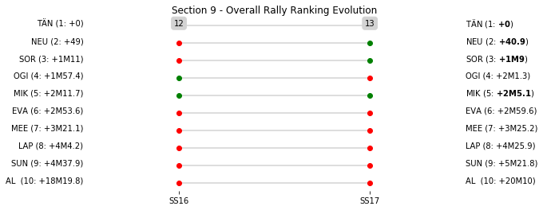

# Section 9, Sunday April 29th

This section comprises two special stages (SS16 - COPINA - EL CONDOR (Live TV) (16.43km), SS17 - GIULIO CESARE - MINA CLAVERO (22.41km))

The full scheduled itinerary for the section was as follows:

	- 07:45:00 TC15D Parc Ferme OUT / Service IN  [00:00:00]
	- 08:00:00 TC15E Service OUT  [00:15:00]
	- 09:00:00 TC16 COPINA - EL CONDOR (Live TV) (38.24km) [01:00:00]
	- 09:08:00 SS16 COPINA - EL CONDOR (Live TV) (16.43km) [00:08:00]
	- 09:52:00 TC17 GIULIO CESARE - MINA CLAVERO (15.98km) [00:44:00]
	- 09:55:00 SS17 GIULIO CESARE - MINA CLAVERO (22.41km) [00:03:00]
	- 11:40:00 TC17A Regrouping and Reordering IN (91.8km) [01:45:00]

### Section 9 Report
Section 9

Section 9

Stage Result - SS16

|Driver|            Team             |Elapsed Duration|Position|Class Rank|   diffFirst    |    diffPrev    |
|------|-----------------------------|----------------|-------:|---------:|----------------|----------------|
|MIK   |HYUNDAI SHELL MOBIS WRT      |00:13:09.5000000|       1|         1|00:00:00        |00:00:00        |
|OGI   |M-SPORT FORD WORLD RALLY TEAM|00:13:10        |       2|         2|00:00:00.5000000|00:00:00.5000000|
|TÄN   |TOYOTA GAZOO RACING WRT      |00:13:11.6000000|       3|         3|00:00:02.1000000|00:00:01.6000000|
|MEE   |CITROEN TOTAL ABU DHABI WRT  |00:13:12.3000000|       4|         4|00:00:02.8000000|00:00:00.7000000|
|NEU   |HYUNDAI SHELL MOBIS WRT      |00:13:14.1000000|       5|         5|00:00:04.6000000|00:00:01.8000000|
|SOR   |HYUNDAI SHELL MOBIS WRT      |00:13:14.4000000|       6|         6|00:00:04.9000000|00:00:00.3000000|
|EVA   |M-SPORT FORD WORLD RALLY TEAM|00:13:16.1000000|       7|         7|00:00:06.6000000|00:00:01.7000000|
|SUN   |M-SPORT FORD WORLD RALLY TEAM|00:13:31.9000000|       9|         8|00:00:22.4000000|00:00:02.1000000|
|AL    |CITROEN TOTAL ABU DHABI WRT  |00:14:14.2000000|      16|         9|00:01:04.7000000|00:00:00.6000000|
|LAP   |TOYOTA GAZOO RACING WRT      |00:14:32.9000000|      19|        10|00:01:23.4000000|00:00:14.7000000|

Stage Result - SS17

|Driver|            Team             |Elapsed Duration|Position|Class Rank|   diffFirst    |    diffPrev    |
|------|-----------------------------|----------------|-------:|---------:|----------------|----------------|
|NEU   |HYUNDAI SHELL MOBIS WRT      |00:18:31.3000000|       1|         1|00:00:00        |00:00:00        |
|MIK   |HYUNDAI SHELL MOBIS WRT      |00:18:32.8000000|       2|         2|00:00:01.5000000|00:00:01.5000000|
|SOR   |HYUNDAI SHELL MOBIS WRT      |00:18:37.4000000|       3|         3|00:00:06.1000000|00:00:04.6000000|
|TÄN   |TOYOTA GAZOO RACING WRT      |00:18:39.4000000|       4|         4|00:00:08.1000000|00:00:02        |
|OGI   |M-SPORT FORD WORLD RALLY TEAM|00:18:43.3000000|       5|         5|00:00:12        |00:00:03.9000000|
|MEE   |CITROEN TOTAL ABU DHABI WRT  |00:18:43.5000000|       6|         6|00:00:12.2000000|00:00:00.2000000|
|EVA   |M-SPORT FORD WORLD RALLY TEAM|00:18:45.4000000|       7|         7|00:00:14.1000000|00:00:01.9000000|
|LAP   |TOYOTA GAZOO RACING WRT      |00:19:01.1000000|       9|         8|00:00:29.8000000|00:00:15.5000000|
|SUN   |M-SPORT FORD WORLD RALLY TEAM|00:19:23.3000000|      11|         9|00:00:52        |00:00:06        |
|AL    |CITROEN TOTAL ABU DHABI WRT  |00:20:29.6000000|      18|        10|00:01:58.3000000|00:00:15.9000000|

