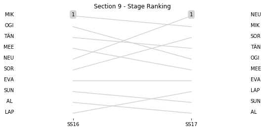

# Section 9, Sunday April 29th

This section comprises two special stages (SS16 - COPINA - EL CONDOR (Live TV) (16.43km), SS17 - GIULIO CESARE - MINA CLAVERO (22.41km))

The full scheduled itinerary for the section was as follows:

	- 07:45:00 TC15D Parc Ferme OUT / Service IN  [00:00:00]
	- 08:00:00 TC15E Service OUT  [00:15:00]
	- 09:00:00 TC16 COPINA - EL CONDOR (Live TV) (38.24km) [01:00:00]
	- 09:08:00 SS16 COPINA - EL CONDOR (Live TV) (16.43km) [00:08:00]
	- 09:52:00 TC17 GIULIO CESARE - MINA CLAVERO (15.98km) [00:44:00]
	- 09:55:00 SS17 GIULIO CESARE - MINA CLAVERO (22.41km) [00:03:00]
	- 11:40:00 TC17A Regrouping and Reordering IN (91.8km) [01:45:00]

### Section 9 Report
Section 9

Stage Result - SS16

|Driver|            Team             |Elapsed Duration|Position|Class Rank|diffFirst|diffPrev|
|------|-----------------------------|----------------|--------|----------|---------|--------|
|SOR   |HYUNDAI SHELL MOBIS WRT      |                |NaN     |NaN       |         |        |
|OGI   |M-SPORT FORD WORLD RALLY TEAM|                |NaN     |NaN       |         |        |
|MIK   |HYUNDAI SHELL MOBIS WRT      |                |NaN     |NaN       |         |        |
|NEU   |HYUNDAI SHELL MOBIS WRT      |                |NaN     |NaN       |         |        |
|LAP   |TOYOTA GAZOO RACING WRT      |                |NaN     |NaN       |         |        |
|EVA   |M-SPORT FORD WORLD RALLY TEAM|                |NaN     |NaN       |         |        |
|MEE   |CITROEN TOTAL ABU DHABI WRT  |                |NaN     |NaN       |         |        |
|SUN   |M-SPORT FORD WORLD RALLY TEAM|                |NaN     |NaN       |         |        |
|AL    |CITROEN TOTAL ABU DHABI WRT  |                |NaN     |NaN       |         |        |
|TÄN   |TOYOTA GAZOO RACING WRT      |                |NaN     |NaN       |         |        |

Stage Result - SS17

|Driver|            Team             |Elapsed Duration|Position|Class Rank|diffFirst|diffPrev|
|------|-----------------------------|----------------|--------|----------|---------|--------|
|SOR   |HYUNDAI SHELL MOBIS WRT      |                |NaN     |NaN       |         |        |
|OGI   |M-SPORT FORD WORLD RALLY TEAM|                |NaN     |NaN       |         |        |
|MIK   |HYUNDAI SHELL MOBIS WRT      |                |NaN     |NaN       |         |        |
|LAP   |TOYOTA GAZOO RACING WRT      |                |NaN     |NaN       |         |        |
|MEE   |CITROEN TOTAL ABU DHABI WRT  |                |NaN     |NaN       |         |        |
|SUN   |M-SPORT FORD WORLD RALLY TEAM|                |NaN     |NaN       |         |        |
|AL    |CITROEN TOTAL ABU DHABI WRT  |                |NaN     |NaN       |         |        |
|EVA   |M-SPORT FORD WORLD RALLY TEAM|                |NaN     |NaN       |         |        |
|NEU   |HYUNDAI SHELL MOBIS WRT      |                |NaN     |NaN       |         |        |
|TÄN   |TOYOTA GAZOO RACING WRT      |                |NaN     |NaN       |         |        |

